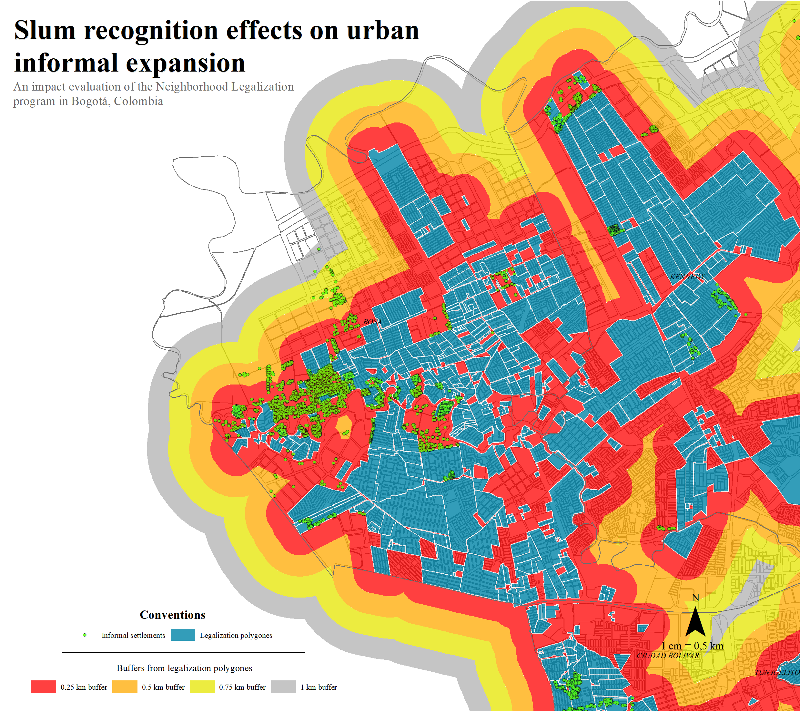

This repo contains all data files realted to the paper "Slum recognition effects on urban informal expansion: An impact evaluation of the Neighborhood Legalization program in Bogotá, Colombia" (2023) by G. Camargo, P. Acosta, J. Vargas.

## Abstract

## Information in the repo

| Folder                                                                                                    | File | Description | Source |
|-----------------------------------------------------------------------------------------------------------|------|-------------|--------|
| [00_geographic_data](https://github.com/Guibi1994/Neighborhood_Legalization/tree/main/00_geographic_data) |      |             |        |
|                                                                                                           |      |             |        |
|                                                                                                           |      |             |        |
